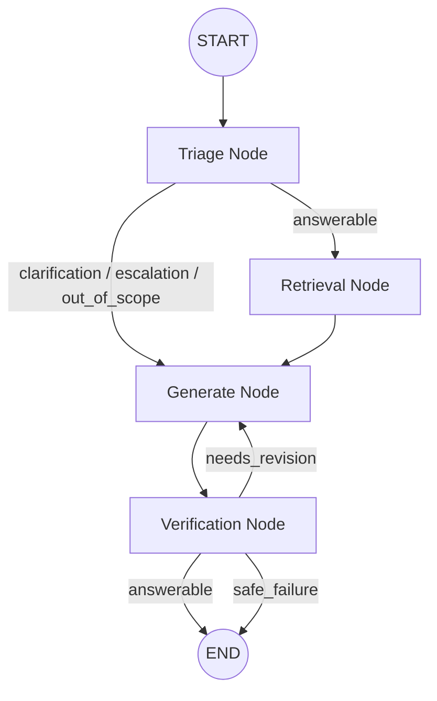

# OrbitDesk Local-First Support Agent Network

This repository contains the implementation of a local-first AI Support Agent Network for the OrbitDesk fictional product. The solution uses LangGraph for orchestration and Hugging Face models for local, offline execution.

## Features & Architecture

The workflow is built as a state graph with the following responsibilities:
1. **Triage Node**: Classifies incoming requests into four categories (Answerable, Clarification, Escalation, Out of Scope) using a local LLM.
2. **Retrieval Node**: Retrieves relevant passages from the markdown knowledge base and previous resolved cases using a lightweight local embedding model and FAISS vector search.
3. **Generator Node**: Generates the final support response based *only* on the retrieved context to prevent hallucination.
4. **Verifier Node**: Evaluates the generated answer against the retrieved evidence. If the verification fails, it can trigger a retry or a safe-failure.

### Models Used
* **Embeddings & Retrieval**: `sentence-transformers/all-MiniLM-L6-v2` (Fast and lightweight CPU-friendly embedding model).
* **Generation & Reasoning**: `Qwen/Qwen2.5-0.5B-Instruct` (A highly efficient, quantized 0.5B parameter model chosen for extremely fast local execution and low memory footprint).

### AI Assistant Disclosure
*This project was developed with the assistance of an AI coding assistant, as permitted by the assignment guidelines.*

## Hardware Requirements
- **CPU**: Multi-core processor (tested on [Insert Your CPU])
- **RAM**: Minimum 8GB (16GB recommended for smooth model loading)
- **GPU (Optional but recommended)**: [Insert Your GPU, e.g., NVIDIA RTX 3060 / None - ran on CPU]

## Setup Instructions

1. **Clone the repository**:
   ```bash
   git clone <your-repo-link>
   cd <your-repo>
   ```

2. **Create a Virtual Environment**:
   ```bash
   python -m venv .venv
   source .venv/bin/activate  # On Windows use: .\.venv\Scripts\activate
   ```

3. **Install Dependencies**:
   ```bash
   pip install -r requirements.txt
   ```

## Running the Application

### Method 1: Web Interface (FastAPI)
Launch the interactive web UI and API server:
```bash
python -m uvicorn api:app --reload
```
Then open `http://127.0.0.1:8000/` in your browser to interact with the UI, or `http://127.0.0.1:8000/docs` to test the API directly.

### Method 2: Batch Processing
Run the CLI to automatically process the sample questions:
```bash
python main.py
```
This will output the categorized answers to the console and save the structured results to `outputs.json`.

### Method 3: Automated Tests
Run the test suite to verify graph routing without depending on exact LLM wording:
```bash
pytest tests/test_workflow.py
```

## Graph Diagram


*(You can take a screenshot of this diagram using a markdown viewer to submit for the PNG requirement).*
